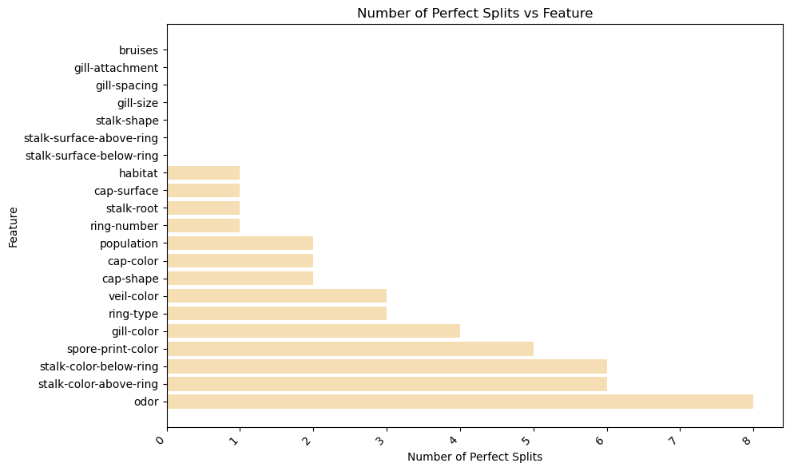
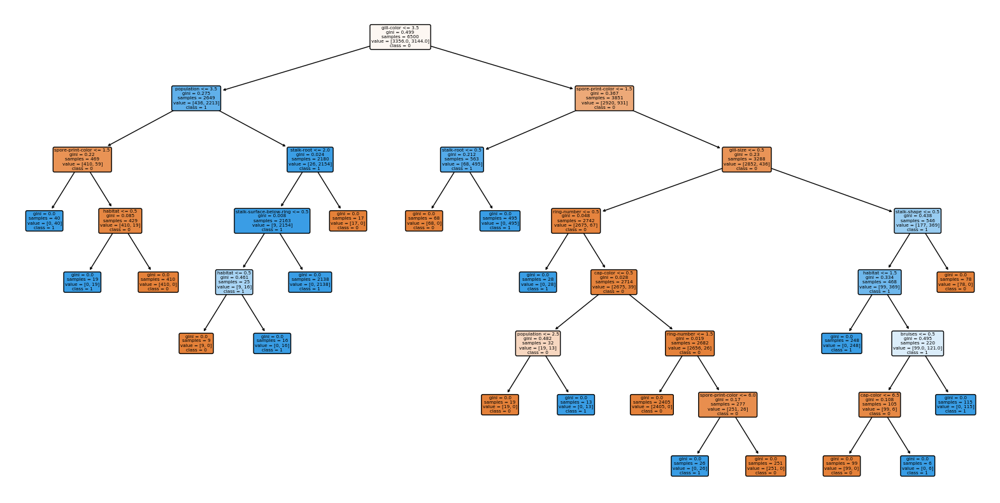

---
output:
  word_document: default
  html_document: default
---
```python
#Importing necessary libraries
import pandas as pd
import numpy as np
from sklearn.model_selection import train_test_split, GridSearchCV
from sklearn.preprocessing import StandardScaler, OneHotEncoder
from sklearn.compose import ColumnTransformer
from sklearn.pipeline import Pipeline
from sklearn.ensemble import RandomForestClassifier
from sklearn.metrics import classification_report, roc_auc_score
```


```python
#Loading the dataset
mushroom = pd.read_csv('/Users/shraddha/Desktop/MPSA - SHRADDHA GUPTE/Fall 2024 Q3/Data Mining Applications - ALY 6040/Module 2/Copy of mushrooms.csv')
```


```python
#str of the data 
mushroom_str = str(mushroom)
mushroom_str
print(mushroom.head())
print(mushroom.describe())
print(mushroom.isnull().sum())
print(mushroom.groupby('class').size())
```

      class cap-shape cap-surface cap-color bruises odor gill-attachment  \
    0     p         x           s         n       t    p               f   
    1     e         x           s         y       t    a               f   
    2     e         b           s         w       t    l               f   
    3     p         x           y         w       t    p               f   
    4     e         x           s         g       f    n               f   
    
      gill-spacing gill-size gill-color  ... stalk-surface-below-ring  \
    0            c         n          k  ...                        s   
    1            c         b          k  ...                        s   
    2            c         b          n  ...                        s   
    3            c         n          n  ...                        s   
    4            w         b          k  ...                        s   
    
      stalk-color-above-ring stalk-color-below-ring veil-type veil-color  \
    0                      w                      w         p          w   
    1                      w                      w         p          w   
    2                      w                      w         p          w   
    3                      w                      w         p          w   
    4                      w                      w         p          w   
    
      ring-number ring-type spore-print-color population habitat  
    0           o         p                 k          s       u  
    1           o         p                 n          n       g  
    2           o         p                 n          n       m  
    3           o         p                 k          s       u  
    4           o         e                 n          a       g  
    
    [5 rows x 23 columns]
           class cap-shape cap-surface cap-color bruises  odor gill-attachment  \
    count   8124      8124        8124      8124    8124  8124            8124   
    unique     2         6           4        10       2     9               2   
    top        e         x           y         n       f     n               f   
    freq    4208      3656        3244      2284    4748  3528            7914   
    
           gill-spacing gill-size gill-color  ... stalk-surface-below-ring  \
    count          8124      8124       8124  ...                     8124   
    unique            2         2         12  ...                        4   
    top               c         b          b  ...                        s   
    freq           6812      5612       1728  ...                     4936   
    
           stalk-color-above-ring stalk-color-below-ring veil-type veil-color  \
    count                    8124                   8124      8124       8124   
    unique                      9                      9         1          4   
    top                         w                      w         p          w   
    freq                     4464                   4384      8124       7924   
    
           ring-number ring-type spore-print-color population habitat  
    count         8124      8124              8124       8124    8124  
    unique           3         5                 9          6       7  
    top              o         p                 w          v       d  
    freq          7488      3968              2388       4040    3148  
    
    [4 rows x 23 columns]
    class                       0
    cap-shape                   0
    cap-surface                 0
    cap-color                   0
    bruises                     0
    odor                        0
    gill-attachment             0
    gill-spacing                0
    gill-size                   0
    gill-color                  0
    stalk-shape                 0
    stalk-root                  0
    stalk-surface-above-ring    0
    stalk-surface-below-ring    0
    stalk-color-above-ring      0
    stalk-color-below-ring      0
    veil-type                   0
    veil-color                  0
    ring-number                 0
    ring-type                   0
    spore-print-color           0
    population                  0
    habitat                     0
    dtype: int64
    class
    e    4208
    p    3916
    dtype: int64


```python
# number of rows with missing values
num_missing_rows = len(mushroom) - mushroom.dropna().shape[0]
```


```python
# deleting redundant variable `veil-type`
mushroom.drop('veil-type', axis=1, inplace=True)
```


```python
#analyzing the odor variable
contingency_table = pd.crosstab(mushroom['class'], mushroom['odor'])
print(contingency_table)

def perfect_splits(col):
    t = pd.crosstab(mushroom['class'], col)
    return np.sum(t.values == 0)

# Apply the function to all columns except the first
number_perfect_splits = mushroom.iloc[:, 1:].apply(perfect_splits, axis=0)

print(number_perfect_splits)
```

    odor     a    c     f    l   m     n    p    s    y
    class                                              
    e      400    0     0  400   0  3408    0    0    0
    p        0  192  2160    0  36   120  256  576  576
    cap-shape                   2
    cap-surface                 1
    cap-color                   2
    bruises                     0
    odor                        8
    gill-attachment             0
    gill-spacing                0
    gill-size                   0
    gill-color                  4
    stalk-shape                 0
    stalk-root                  1
    stalk-surface-above-ring    0
    stalk-surface-below-ring    0
    stalk-color-above-ring      6
    stalk-color-below-ring      6
    veil-color                  3
    ring-number                 1
    ring-type                   3
    spore-print-color           5
    population                  2
    habitat                     1
    dtype: int64


```python
# Descending order of perfect splits
sorted_number_perfect_splits = number_perfect_splits.sort_values(ascending=False)

# The result is already ordered, so no need to use a separate order variable
print(sorted_number_perfect_splits)

```

    odor                        8
    stalk-color-above-ring      6
    stalk-color-below-ring      6
    spore-print-color           5
    gill-color                  4
    ring-type                   3
    veil-color                  3
    cap-shape                   2
    cap-color                   2
    population                  2
    ring-number                 1
    stalk-root                  1
    cap-surface                 1
    habitat                     1
    stalk-surface-below-ring    0
    stalk-surface-above-ring    0
    stalk-shape                 0
    gill-size                   0
    gill-spacing                0
    gill-attachment             0
    bruises                     0
    dtype: int64


```python
# Plot graph
import matplotlib.pyplot as plt

# Adjust margins 
plt.figure(figsize=(10, 6)) 

# Create the bar plot
plt.barh(sorted_number_perfect_splits.index, sorted_number_perfect_splits, color='wheat')

# Add labels and title
plt.title('Number of Perfect Splits vs Feature')
plt.xlabel('Number of Perfect Splits')
plt.ylabel('Feature')

# Rotate x-axis labels (similar to las=2 in R, which rotates labels)
plt.xticks(rotation=45, ha='right')

# Show the plot
plt.tight_layout()  
plt.show()

```


    

    


```python
#data splicing
# Set the random seed for reproducibility
np.random.seed(12345)

# Determine the number of rows for training (80% of the dataset)
train_size = int(np.ceil(0.80 * len(mushroom)))

# Randomly sample row indices for the training set
train_indices = np.random.choice(mushroom.index, size=train_size, replace=False)

# Split the dataset into training and test sets
mushroom_train = mushroom.loc[train_indices]
mushroom_test = mushroom.drop(train_indices)

print(f"Training set size: {mushroom_train.shape}")
print(f"Test set size: {mushroom_test.shape}")
```

    Training set size: (6500, 22)
    Test set size: (1624, 22)


```python
#Penalty Matrix
penalty_matrix = np.array([[0, 1], [10, 0]])

print(penalty_matrix)
```

    [[ 0  1]
     [10  0]]


```python
# building the classification tree with rpart
from sklearn.tree import DecisionTreeClassifier, plot_tree
from sklearn.model_selection import GridSearchCV
from sklearn.metrics import confusion_matrix, accuracy_score
from sklearn.preprocessing import LabelEncoder
import matplotlib.pyplot as plt

label_encoders = {}
for column in mushroom_train.columns:
    le = LabelEncoder()
    mushroom_train[column] = le.fit_transform(mushroom_train[column])
    label_encoders[column] = le
for column in mushroom_test.columns:
    mushroom_test[column] = label_encoders[column].transform(mushroom_test[column])

# Create and fit the decision tree classifier
tree = DecisionTreeClassifier(random_state=12345)
```


```python
# Visualize the decision tree with rpart.plot
param_grid = {'max_depth': np.arange(1, 21)}  # Adjust the range as necessary
grid_search = GridSearchCV(tree, param_grid, cv=5, scoring='accuracy')
grid_search.fit(mushroom_train.drop(columns=['class']), mushroom_train['class'])
if hasattr(grid_search, 'best_params_'):
    best_max_depth = grid_search.best_params_['max_depth']
else:
    print("Grid search did not complete successfully.")
    best_max_depth = None

```


```python
# choosing the best complexity parameter "cp" to prune the tree
if best_max_depth is not None:
    tree = DecisionTreeClassifier(random_state=12345, max_depth=best_max_depth)
    tree.fit(mushroom_train.drop(columns=['class']), mushroom_train['class'])

    # Visualize the decision tree
    plt.figure(figsize=(20, 10))
    plot_tree(tree, filled=True, feature_names=mushroom_train.columns[1:], 
              class_names=np.unique(mushroom_train['class']).astype(str), rounded=True)
    plt.show()

```


    

    


```python
#Testing the model
pred = tree.predict(mushroom_test.drop(columns=['class']))

```


```python
#Calculating accuracy
accuracy = accuracy_score(mushroom_test['class'], pred)
conf_matrix = confusion_matrix(mushroom_test['class'], pred)
  
print(f"Accuracy: {accuracy}")
print("Confusion Matrix:")
print(conf_matrix)
print("Best max depth not found; cannot fit and test the model.")
```

    Accuracy: 1.0
    Confusion Matrix:
    [[852   0]
     [  0 772]]
    Best max depth not found; cannot fit and test the model.

