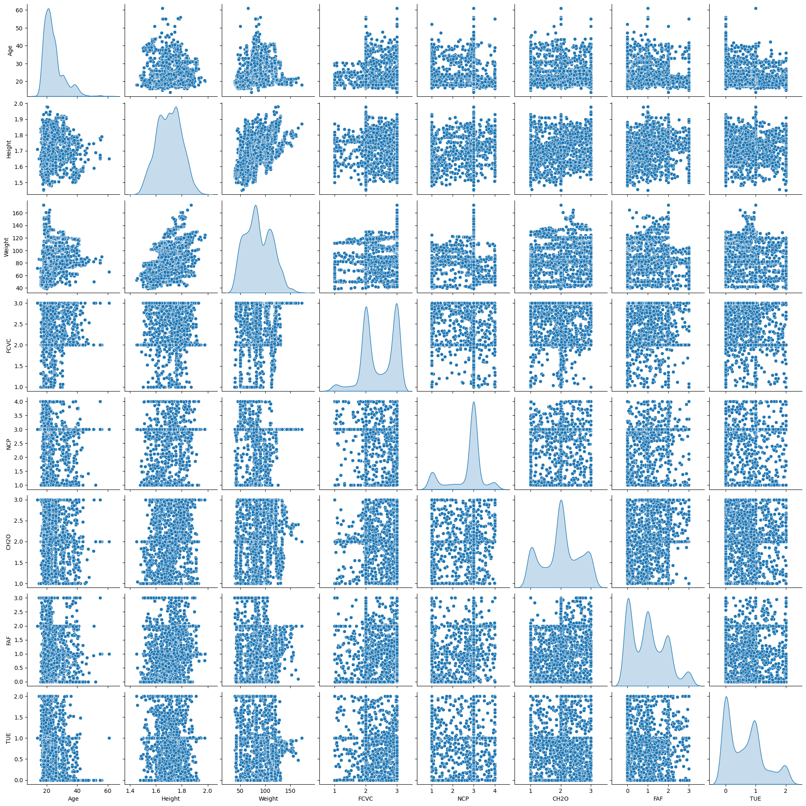
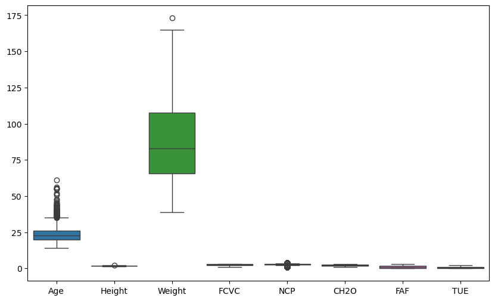
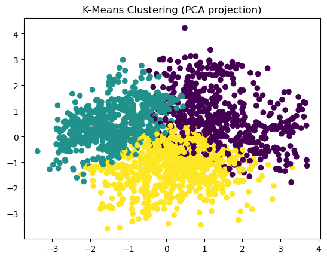
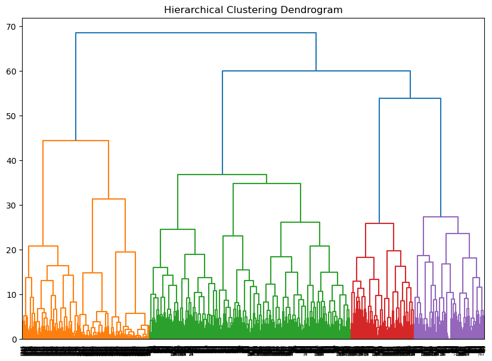
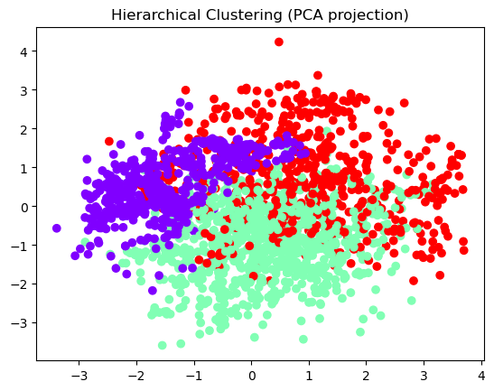
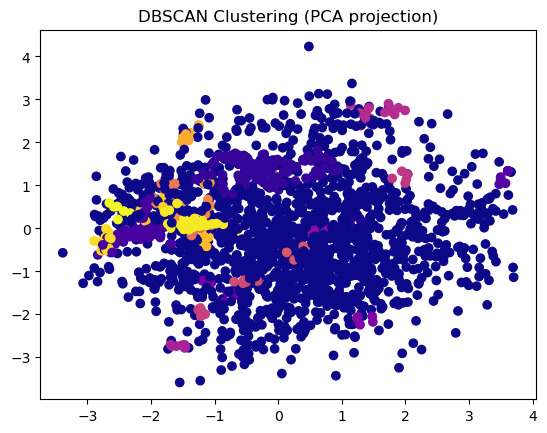
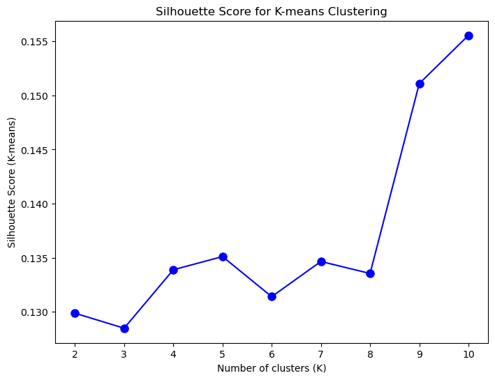
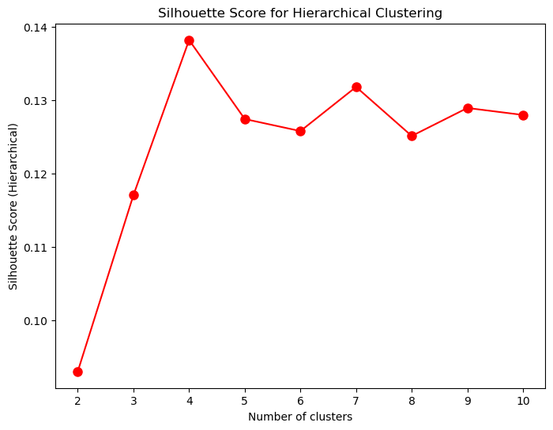

---
output:
  word_document: default
  html_document: default
---
```python
# Importing necessary libraries
import pandas as pd
import numpy as np
import seaborn as sns
import matplotlib.pyplot as plt
from sklearn.preprocessing import StandardScaler
from sklearn.decomposition import PCA
from sklearn.cluster import KMeans, DBSCAN
from scipy.cluster.hierarchy import dendrogram, linkage, fcluster
from sklearn.metrics import silhouette_score

```


```python
# Loading the dataset
Obesity = pd.read_csv('/Users/shraddha/Desktop/MPSA - SHRADDHA GUPTE/Fall 2024 Q3/Data Mining Applications - ALY 6040/Module3/ObesityDataSet_raw_and_data_sinthetic.csv')  
```


```python
# Understanding the Data
print(Obesity.info())  
print(Obesity.describe())  
```

    <class 'pandas.core.frame.DataFrame'>
    RangeIndex: 2111 entries, 0 to 2110
    Data columns (total 17 columns):
     #   Column                          Non-Null Count  Dtype  
    ---  ------                          --------------  -----  
     0   Gender                          2111 non-null   object 
     1   Age                             2111 non-null   float64
     2   Height                          2111 non-null   float64
     3   Weight                          2111 non-null   float64
     4   family_history_with_overweight  2111 non-null   object 
     5   FAVC                            2111 non-null   object 
     6   FCVC                            2111 non-null   float64
     7   NCP                             2111 non-null   float64
     8   CAEC                            2111 non-null   object 
     9   SMOKE                           2111 non-null   object 
     10  CH2O                            2111 non-null   float64
     11  SCC                             2111 non-null   object 
     12  FAF                             2111 non-null   float64
     13  TUE                             2111 non-null   float64
     14  CALC                            2111 non-null   object 
     15  MTRANS                          2111 non-null   object 
     16  NObeyesdad                      2111 non-null   object 
    dtypes: float64(8), object(9)
    memory usage: 280.5+ KB
    None
                   Age       Height       Weight         FCVC          NCP  \
    count  2111.000000  2111.000000  2111.000000  2111.000000  2111.000000   
    mean     24.312600     1.701677    86.586058     2.419043     2.685628   
    std       6.345968     0.093305    26.191172     0.533927     0.778039   
    min      14.000000     1.450000    39.000000     1.000000     1.000000   
    25%      19.947192     1.630000    65.473343     2.000000     2.658738   
    50%      22.777890     1.700499    83.000000     2.385502     3.000000   
    75%      26.000000     1.768464   107.430682     3.000000     3.000000   
    max      61.000000     1.980000   173.000000     3.000000     4.000000   
    
                  CH2O          FAF          TUE  
    count  2111.000000  2111.000000  2111.000000  
    mean      2.008011     1.010298     0.657866  
    std       0.612953     0.850592     0.608927  
    min       1.000000     0.000000     0.000000  
    25%       1.584812     0.124505     0.000000  
    50%       2.000000     1.000000     0.625350  
    75%       2.477420     1.666678     1.000000  
    max       3.000000     3.000000     2.000000  


```python
# Creating Data visualization
sns.pairplot(Obesity, diag_kind='kde')
plt.show()
```


    

    


```python
# Checking for outliers in data
plt.figure(figsize=(10, 6))
sns.boxplot(data=Obesity)
plt.show()
```


    

    


```python
from sklearn.impute import SimpleImputer
from sklearn.compose import ColumnTransformer
from sklearn.pipeline import Pipeline

# Handling missing values
print(Obesity.isnull().sum())

# Define columns that are numerical and categorical
numeric_cols = Obesity.select_dtypes(include=['int64', 'float64']).columns
categorical_cols = Obesity.select_dtypes(include=['object', 'category']).columns

# Imputing missing values
numeric_imputer = SimpleImputer(strategy='mean')
categorical_imputer = SimpleImputer(strategy='most_frequent')
```

    Gender                            0
    Age                               0
    Height                            0
    Weight                            0
    family_history_with_overweight    0
    FAVC                              0
    FCVC                              0
    NCP                               0
    CAEC                              0
    SMOKE                             0
    CH2O                              0
    SCC                               0
    FAF                               0
    TUE                               0
    CALC                              0
    MTRANS                            0
    NObeyesdad                        0
    dtype: int64


```python
from sklearn.preprocessing import StandardScaler, OneHotEncoder
# Encoding categorical variables
onehot_encoder = OneHotEncoder(drop='first')
```


```python
# Normalizing/Standardizing numerical features
scaler = StandardScaler()
```


```python
# Combine all preprocessing steps using ColumnTransformer
preprocessor = ColumnTransformer(
    transformers=[
        ('num', Pipeline(steps=[('imputer', numeric_imputer), ('scaler', scaler)]), numeric_cols),
        ('cat', Pipeline(steps=[('imputer', categorical_imputer), ('onehot', onehot_encoder)]), categorical_cols)
    ])

# Apply preprocessing
data_preprocessed = preprocessor.fit_transform(Obesity)

encoded_columns = preprocessor.named_transformers_['cat']['onehot'].get_feature_names_out(categorical_cols)
columns = list(numeric_cols) + list(encoded_columns)

# Convert preprocessed data back into a DataFrame
New_Obesity = pd.DataFrame(data_preprocessed, columns=columns)

# Check the preprocessed DataFrame
print(New_Obesity.head())

```

            Age    Height    Weight      FCVC       NCP      CH2O       FAF  \
    0 -0.522124 -0.875589 -0.862558 -0.785019  0.404153 -0.013073 -1.188039   
    1 -0.522124 -1.947599 -1.168077  1.088342  0.404153  1.618759  2.339750   
    2 -0.206889  1.054029 -0.366090 -0.785019  0.404153 -0.013073  1.163820   
    3  0.423582  1.054029  0.015808  1.088342  0.404153 -0.013073  1.163820   
    4 -0.364507  0.839627  0.122740 -0.785019 -2.167023 -0.013073 -1.188039   
    
            TUE  Gender_Male  family_history_with_overweight_yes  ...  \
    0  0.561997          0.0                                 1.0  ...   
    1 -1.080625          0.0                                 1.0  ...   
    2  0.561997          1.0                                 1.0  ...   
    3 -1.080625          1.0                                 0.0  ...   
    4 -1.080625          1.0                                 0.0  ...   
    
       MTRANS_Bike  MTRANS_Motorbike  MTRANS_Public_Transportation  \
    0          0.0               0.0                           1.0   
    1          0.0               0.0                           1.0   
    2          0.0               0.0                           1.0   
    3          0.0               0.0                           0.0   
    4          0.0               0.0                           1.0   
    
       MTRANS_Walking  NObeyesdad_Normal_Weight  NObeyesdad_Obesity_Type_I  \
    0             0.0                       1.0                        0.0   
    1             0.0                       1.0                        0.0   
    2             0.0                       1.0                        0.0   
    3             1.0                       0.0                        0.0   
    4             0.0                       0.0                        0.0   
    
       NObeyesdad_Obesity_Type_II  NObeyesdad_Obesity_Type_III  \
    0                         0.0                          0.0   
    1                         0.0                          0.0   
    2                         0.0                          0.0   
    3                         0.0                          0.0   
    4                         0.0                          0.0   
    
       NObeyesdad_Overweight_Level_I  NObeyesdad_Overweight_Level_II  
    0                            0.0                             0.0  
    1                            0.0                             0.0  
    2                            0.0                             0.0  
    3                            1.0                             0.0  
    4                            0.0                             1.0  
    
    [5 rows x 29 columns]


```python
from sklearn.decomposition import PCA

# Setting the number of components to retain
pca = PCA(n_components=0.95)  
# Apply PCA on the preprocessed data
Obesity_df = pca.fit_transform(New_Obesity)

explained_variance = pca.explained_variance_ratio_
print(f"Explained variance by each component: {explained_variance}")
print(f"Total variance explained by PCA: {np.sum(explained_variance)}")

# Check the shape of the transformed data after PCA
print(f"Original shape: {New_Obesity.shape}, Transformed shape: {Obesity_df.shape}")


```

    Explained variance by each component: [0.18982548 0.15275392 0.11184392 0.09914171 0.09398496 0.07721568
     0.06938026 0.04376288 0.03621589 0.01790999 0.01518121 0.01450657
     0.01310129 0.01159797 0.0095557 ]
    Total variance explained by PCA: 0.9559774200379529
    Original shape: (2111, 29), Transformed shape: (2111, 15)


```python
from sklearn.feature_selection import VarianceThreshold

#Feature Selection and Engineering 
selector = VarianceThreshold(threshold=0.01)
Obesity_select = selector.fit_transform(New_Obesity)

# Check the shape of the data after feature selection
print(f"Original shape: {New_Obesity.shape}, After feature selection: {Obesity_select.shape}")

```

    Original shape: (2111, 29), After feature selection: (2111, 27)


```python
Obsetiy_selected_pca = pca.fit_transform(Obesity_select)

# Check the variance explained again
explained_variance_new = pca.explained_variance_ratio_
print(f"Explained variance by each component after feature engineering: {explained_variance_new}")

```

    Explained variance by each component after feature engineering: [0.18998218 0.15287961 0.1119351  0.09922054 0.09406273 0.07727918
     0.06943745 0.04379712 0.03624574 0.01792369 0.01519292 0.01451736
     0.0131097  0.0116017  0.00955862]


```python
# K Means Clustering 
kmeans = KMeans(n_clusters=3, random_state=42)
kmeans_labels = kmeans.fit_predict(Obesity_select)

# Visualizing K-means clusters
plt.scatter(Obsetiy_selected_pca[:, 0], Obsetiy_selected_pca[:, 1], c=kmeans_labels, cmap='viridis')
plt.title('K-Means Clustering (PCA projection)')
plt.show()

# Silhouette Score for K-means
silhouette_kmeans = silhouette_score(Obesity_select, kmeans_labels)
print(f"Silhouette Score for K-means: {silhouette_kmeans}")

```


    

    


    Silhouette Score for K-means: 0.12848447407568286


```python
# Hierarchical clustering
Z = linkage(Obesity_select, method='ward')

# Plot the dendrogram
plt.figure(figsize=(10, 7))
dendrogram(Z)
plt.title('Hierarchical Clustering Dendrogram')
plt.show()

# Assigning clusters
hierarchical_labels = fcluster(Z, t=3, criterion='maxclust')

# Visualizing Hierarchical clusters
plt.scatter(Obsetiy_selected_pca[:, 0], Obsetiy_selected_pca[:, 1], c=hierarchical_labels, cmap='rainbow')
plt.title('Hierarchical Clustering (PCA projection)')
plt.show()

# Silhouette Score for Hierarchical
silhouette_hierarchical = silhouette_score(Obesity_select, hierarchical_labels)
print(f"Silhouette Score for Hierarchical: {silhouette_hierarchical}")

```


    

    


    

    


    Silhouette Score for Hierarchical: 0.117093636054173


```python
# DBSCAN 
dbscan = DBSCAN(eps=0.5, min_samples=5)
dbscan_labels = dbscan.fit_predict(Obesity_select)

# Visualizing DBSCAN clusters
plt.scatter(Obsetiy_selected_pca[:, 0], Obsetiy_selected_pca[:, 1], c=dbscan_labels, cmap='plasma')
plt.title('DBSCAN Clustering (PCA projection)')
plt.show()

# Silhouette Score for DBSCAN
valid_labels = dbscan_labels[dbscan_labels != -1]
silhouette_dbscan = silhouette_score(Obesity_select[dbscan_labels != -1], valid_labels)
print(f"Silhouette Score for DBSCAN: {silhouette_dbscan}")

```


    

    


    Silhouette Score for DBSCAN: 0.5626358012066242


```python
#Optimising the number of Clusters for K means clustering algorithms
from sklearn.metrics import silhouette_score

silhouette_scores_kmeans = []
silhouette_scores_hierarchical = []
K = range(2, 11) 

# K-means silhouette score
for k in K:
    kmeans = KMeans(n_clusters=k, random_state=42)
    kmeans_labels = kmeans.fit_predict(Obesity_select)
    silhouette_kmeans = silhouette_score(Obesity_select, kmeans_labels)
    silhouette_scores_kmeans.append(silhouette_kmeans)
plt.figure(figsize=(8, 6))
plt.plot(K, silhouette_scores_kmeans, 'bo-', markersize=8)
plt.xlabel('Number of clusters (K)')
plt.ylabel('Silhouette Score (K-means)')
plt.title('Silhouette Score for K-means Clustering')
plt.show()

```


    

    


```python
#Optimising the number of Clusters for Hirarchial clustering algorithms
from scipy.cluster.hierarchy import fcluster, linkage

silhouette_scores_hierarchical = []

# Hierarchical silhouette score 
for k in K:
    Z = linkage(Obesity_select, method='ward')
    hierarchical_labels = fcluster(Z, t=k, criterion='maxclust')
    silhouette_hierarchical = silhouette_score(Obesity_select, hierarchical_labels)
    silhouette_scores_hierarchical.append(silhouette_hierarchical)
plt.figure(figsize=(8, 6))
plt.plot(K, silhouette_scores_hierarchical, 'ro-', markersize=8)
plt.xlabel('Number of clusters')
plt.ylabel('Silhouette Score (Hierarchical)')
plt.title('Silhouette Score for Hierarchical Clustering')
plt.show()

```


    

    


```python
#Tuneing Parameters for DBSCAN
from sklearn.cluster import DBSCAN
from sklearn.metrics import silhouette_score
import numpy as np

# Define ranges of eps and min_samples to search
eps_range = np.arange(0.1, 2.0, 0.1)  
min_samples_range = range(2, 20)  

best_silhouette = -1 
best_eps = None
best_min_samples = None

# Loop over all combinations of eps and min_samples
for eps in eps_range:
    for min_samples in min_samples_range:
        # Apply DBSCAN with current parameters
        dbscan = DBSCAN(eps=eps, min_samples=min_samples)
        dbscan_labels = dbscan.fit_predict(Obesity_select)
        
        # Only compute Silhouette Score if the clustering produced more than 1 cluster
        if len(set(dbscan_labels)) > 1:
            silhouette_avg = silhouette_score(Obesity_select, dbscan_labels)
            
            # If the silhouette score is better, store the best parameters
            if silhouette_avg > best_silhouette:
                best_silhouette = silhouette_avg
                best_eps = eps
                best_min_samples = min_samples

# Print the best parameters and silhouette score
print(f"Best eps: {best_eps}, Best min_samples: {best_min_samples}, Best Silhouette Score: {best_silhouette}")

```

    Best eps: 0.1, Best min_samples: 10, Best Silhouette Score: 0.10062431679573537

